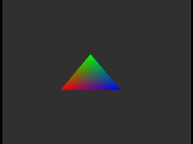

# Basic RSPL Triangle Microcode

A minimal example/reference of [rspl](https://github.com/HailToDodongo/rspl) + [rdpq_triangle](https://libdragon.dev/ref/group__rdpq.html) + [rspq](https://libdragon.dev/ref/rspq_8h.html) working together for a basic triangle scene.

It's also a decent example for rspl and rdpq.

## Prerequisites
- [libdragon](https://github.com/DragonFrogs/libdragon), see [install instructions](https://github.com/DragonMinded/libdragon/wiki/Installing-libdragon)
- [RSPL](https://github.com/HailToDodongo/rspl)
- (Extra) If you wanna make a contribution, use clang format.

## Project Structure
- `src/main.cpp`: Init, the vertex data, and basic draw routine.
- `src/rsp/rsp_example.rspl`: Cmd_DrawTriangle, only dmas in, sets the triangle mode, nothing more.
- `src/rsp_tri_struct.h`: Data structure of an rdpq triangle vertice. Unmodified by the microcode in any way.
- `gdb-multiarch.Dockerfile`: Dockerfile for gdb-multiarch, uses system network to enable gdb debugging on the host without installing, useful for opensuse, does *not* work on Windows.

## How it works:

Internally, we use the macro isolated from rdpq's rsp implementation, rsp_rdpq_tri, which takes in a custom vertex structure (implemented in my project as `rdpq_vertex_t`) that will get calculated into the cooresponding coefficients by the macro.
We provide the start of the tri command, including the cooeficients included and max and start of the tiles.

To use rdpq_vertex_t, one can reference main.cpp's `triangle_vertices` array. Vertex layouts can be changed per microcode, but for the sake of example this is purely default. I also don't handle clipping or cull branches in any special way and triangles are immediately synced. 